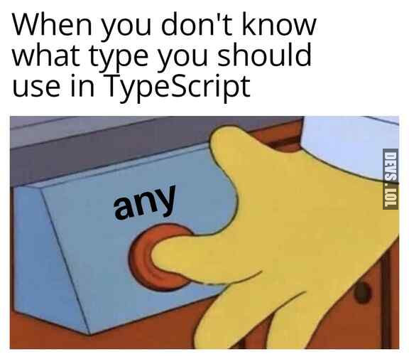

# Learning-Typescript
---

### Objective
Learn about typescript and SOLID typescript. Understanding how it works, and be able to explain it as clear as possible.

## exercise progress
- [x] 0.S
  - extra challenge still to do
- [x] 1.0
- [ ] 2.L
- [ ] 3.I
- [ ] 4.D
---

## exercise solutions
1. 0.S
    - make classes for engine and radio
    - fuel goes into the engine class
    - make engine and radio property in class Car and initiate new object from engine and radio in the constructor of Car
    - getters for radio and engine in Car class (so we can access the properties from the classes engine and radio)
    - in the engine class create functions for reducing fuel and adding mileage
    - call on the above-mentioned function in the Car class
    - Extra challenge TO-DO

2. 1.O
   - added a get sound(original makesound function) to all classes of the animals 
   - changed in the query selector to do "animal.sound"
   - added new class Meerkat
   - deleted all classes besides zoo and made 1 Animal class requiring type and sound as parameters, so I can make multiple animal objects with different types(species) and sounds
   - Classes Cat, Dog, Parrot, Meerkat extending from class Animal
   - decided to make separate files for every Class besides Zoo
   - refactored it to separate files and import/exported them
   - in Zoo class changed generic object(line 8,10 & 14) typings to "Animal" to fix "property x does not exist on value of type"

3. 2.L

if you want to go back to javascript   
🠋 🠋 🠋 🠋 🠋 🠋 🠋 🠋 🠋 🠋 🠋 🠋 🠋 🠋 🠋 🠋 🠋 🠋 🠋 
